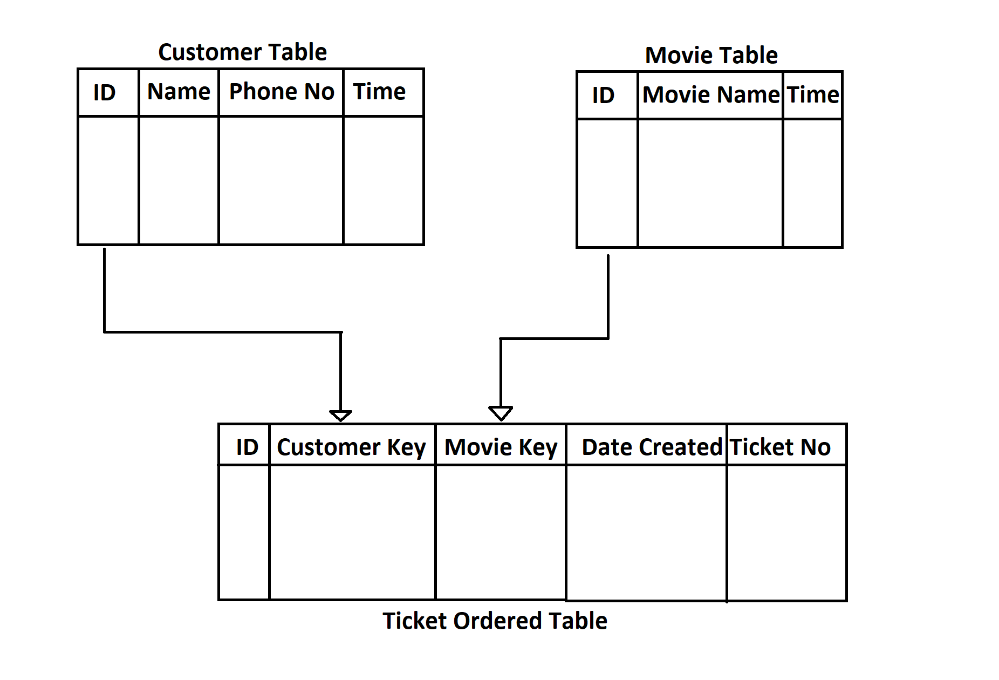
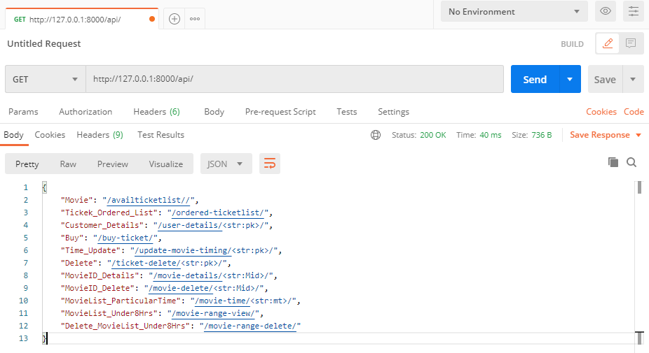
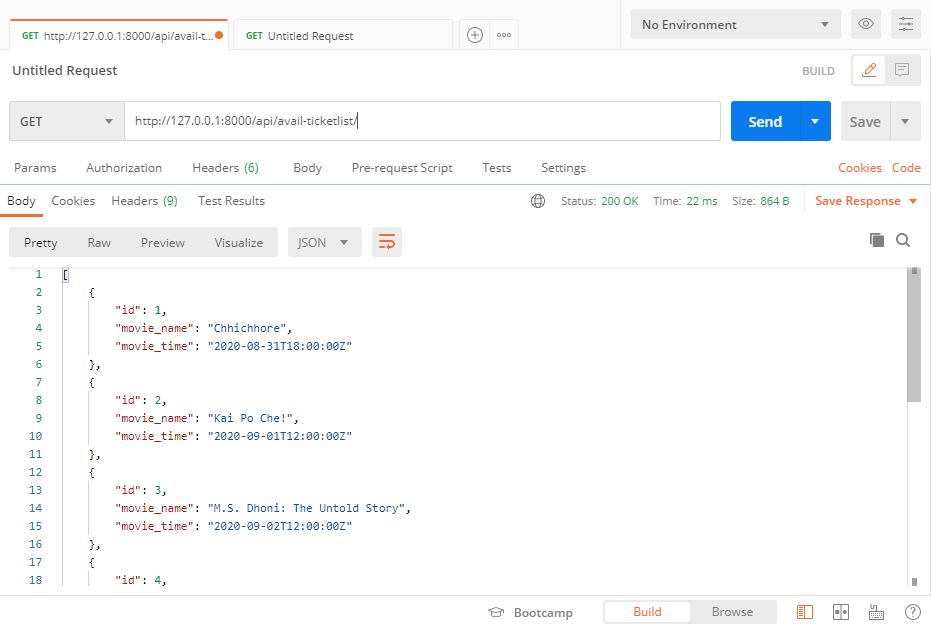
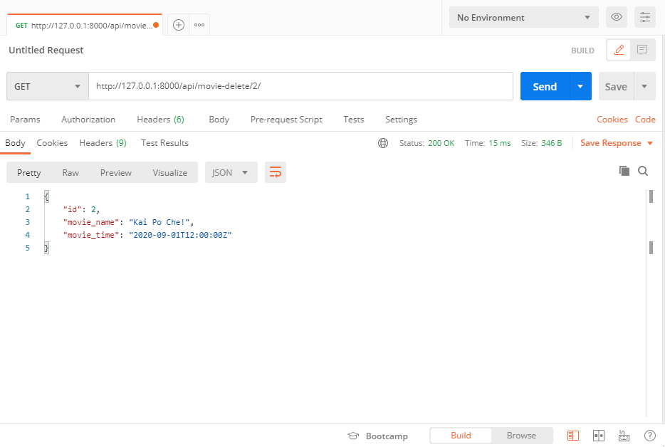
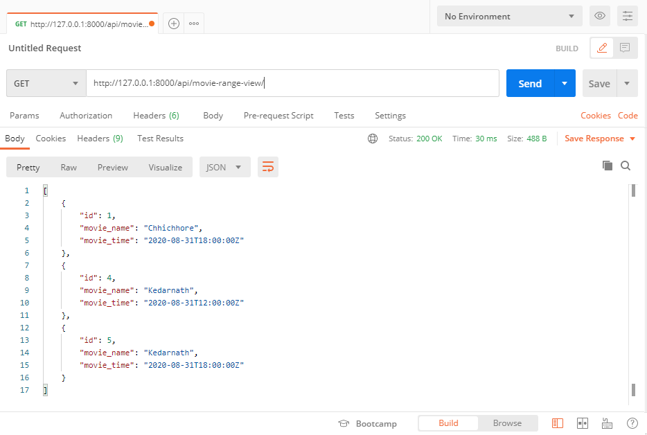
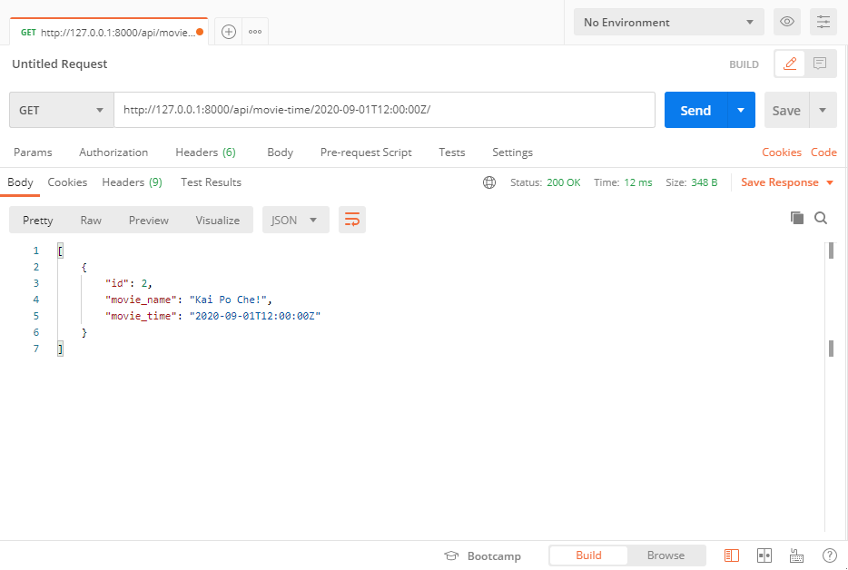
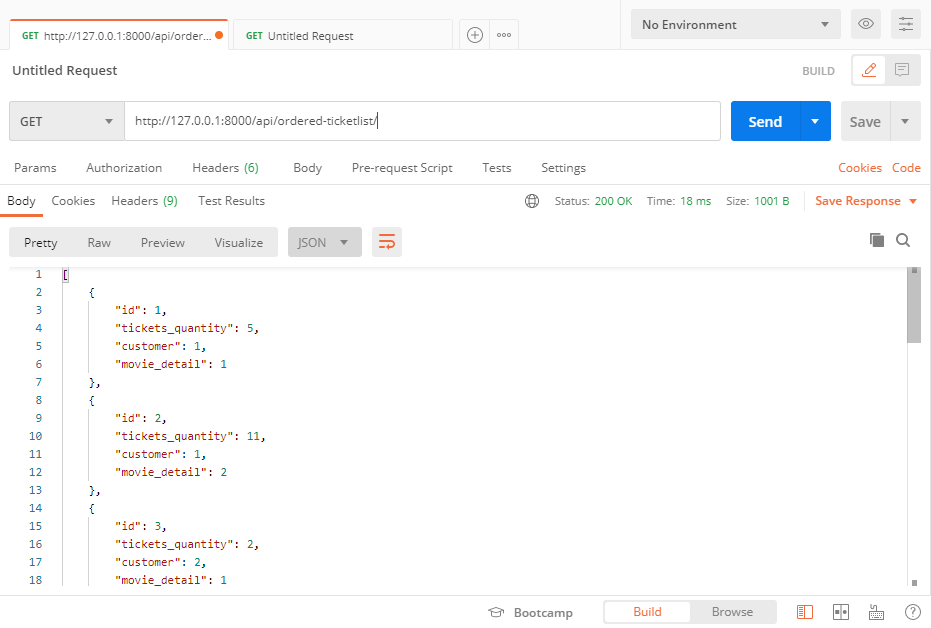
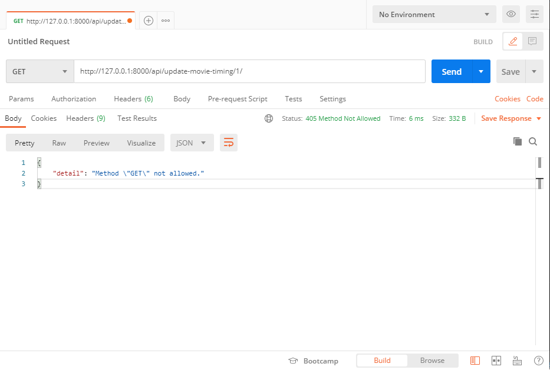

# Movie-theatre-ticket-booking-system_Backend
 
 **TECH STACK**
 Python, Django(Framework), SQLite database
 
 ## SQLite database
 ***************************
 
 ● Customer table     (ID,Name,phone number,time)
 ● Movie table        (ID,Movie name,Movie time)
 ● Ticket Order table (ID,Customer key,Movie key,No. of tickets ordered)
 
 
 ## Rest API Overview
 ***************************
 
 http://127.0.0.1:8000/api/
 ● Contain the list of all rest api created
 
 
 
 ## Show all Avail Movies list
 ***************************

http://127.0.0.1:8000/api/avail-ticketlist/
● Api will show the list of all the movie available to buy.

## POST REST API to Buy tickets
***************************

http://127.0.0.1:8000/api/buy-ticket/
● Post api to buy tickets not more than 20 tickets.
● POST request format:
{
        "tickets_quantity": 5,
        "customer": 1,
        "movie_detail": 1
}
● Ask for customer id,movie id and number of tickets wants to buy.
● Ticket order id will be automatically updated.
● Ticket quantity can't be more than 20 (validation)

## POST REST API Delete Ticket
***************************

http://127.0.0.1:8000/api/movie-delete/<str:Mid>/
● Post api ask for movie id to detele is from database.

## GET REST API to get buyed Movie details by ordered ticket ID
***************************

http://127.0.0.1:8000/api/movie-details/<str:Mid>/
● Post api to get details of movie from ordered ticket's ID

## GET REST API to view all view list under 8Hrs
***************************

http://127.0.0.1:8000/api/movie-range-view/
● Will show the list of all movies which have diff of 8 hours between the ticket timing and current time.

## POST REST API to Delete all view list under 8Hrs
***************************

http://127.0.0.1:8000/api/movie-range-delete/
● Will DELETE the list of all movies which have diff of 8 hours between the ticket timing and current time.

## GET REST API to  get list of movie at the particular time
***************************

http://127.0.0.1:8000/api/avail-ticketlist/
● 

## GET REST API to get the list of all buyed tickets
***************************

http://127.0.0.1:8000/api/avail-ticketlist/
● 

## POST REST API to Update movie time
***************************

http://127.0.0.1:8000/api/avail-ticketlist/
● 

## GET REST API to get customer deatils by ticket ordered id
***************************

http://127.0.0.1:8000/api/avail-ticketlist/
● 
