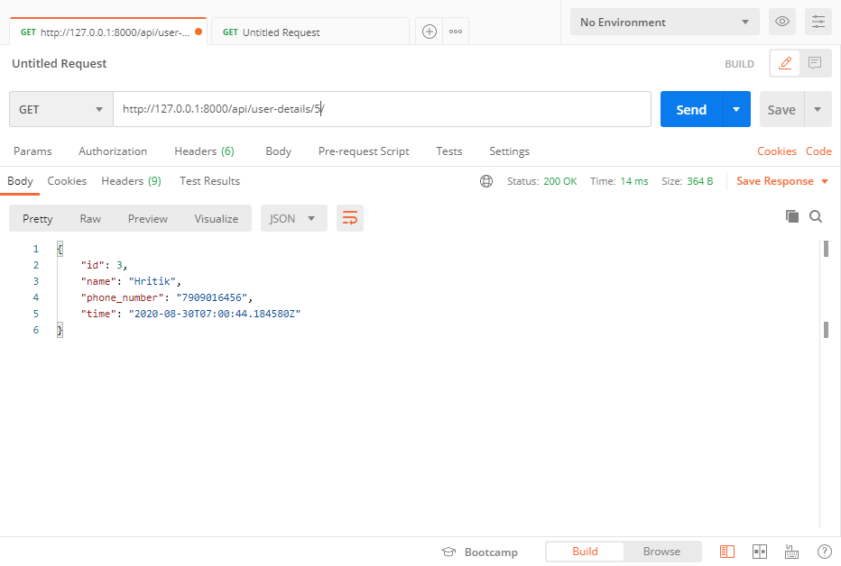

# Movie-theatre-ticket-booking-system_Backend
 
 **TECH STACK**
 Python, Django(Framework), SQLite database
 
 **SQLite database**
 
 
 **Rest API Overview**
 
 Contain the list of all rest api created
 
 **Show all Avail Movies list**

**POST REST API to Buy tickets**

● Ticket quantity can't be more than 20 (validation)

**POST REST API Delete Ticket**

**GET REST API to get buyed Movie details by ticket ordered ID**

**GET REST API to view all view list under 8Hrs**

**GET REST API to view all view list under 8Hrs**

**POST REST API to Delete all view list under 8Hrs**

**GET REST API to  get list of movie at the particular time**

**GET REST API to get the list of all buyed tickets**

**POST REST API to Update movie time**

**GET REST API to get customer deatils by ticket ordered id**

